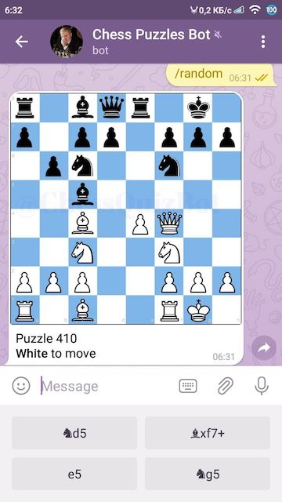

#Chess Quiz Telegram Bot

##About 
This is a Telegram bot that provides chess puzzles.  
Extemely easy to use, especially on your phone. Check it out:

## Supported commands
Current verison supports 3 main user commands:
- /random to get a random puzzle (no rating)
- /quiz to get the next puzzle (affects rating)
- /daily to get lichess daily puzzle

There's also /help and /feedback commands and quite a few admin options that are not available to a regular user.
All custom commands are stored in `quizbot/commands`. 

## Credits
This is built on top of Longman's great PHP telegram bot framework: https://github.com/php-telegram-bot/core 
I made a custom version of tikul's fen-to-png python script to generate images: https://github.com/tikul/fen-to-pn

Special thanks to @mmlart, @igniperch, @MESSSERR, @Kon85 and @BomberHarris_XRP for helping input the chess problems.   

[me]: https://github.com/1int