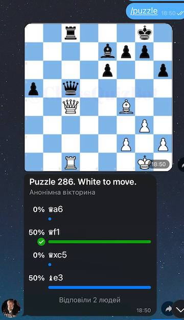

# Chess Quiz Telegram Bot
## About

This is a open source Telegram bot that provides chess puzzles.  
 
Available here: https://t.me/ChessQuizBot

Here's how `/random` command looks like in my private chat:

Here's how `/puzzle` command looks like in a group chat. It produces a poll so that amny people can answer.

## Supported commands
Current verison has these main commands:
- /random to get a random puzzle (no rating)
- /quiz to get the next puzzle (affects rating)
- /top to see current top-rated players

There's also /help and /feedback commands and a few admin tools and stats.
All custom commands are stored in `quizbot/commands`. 

## Credits
This is built on top of Longman's great PHP telegram bot framework: https://github.com/php-telegram-bot/core
 
I made a custom version of tikul's fen-to-png python script to generate images: https://github.com/tikul/fen-to-png

Special thanks to @mmlart, @igniperch, @MESSSERR, @Kon85 and @BomberHarris_XRP for helping input the chess problems.   

[me]: https://github.com/1int
